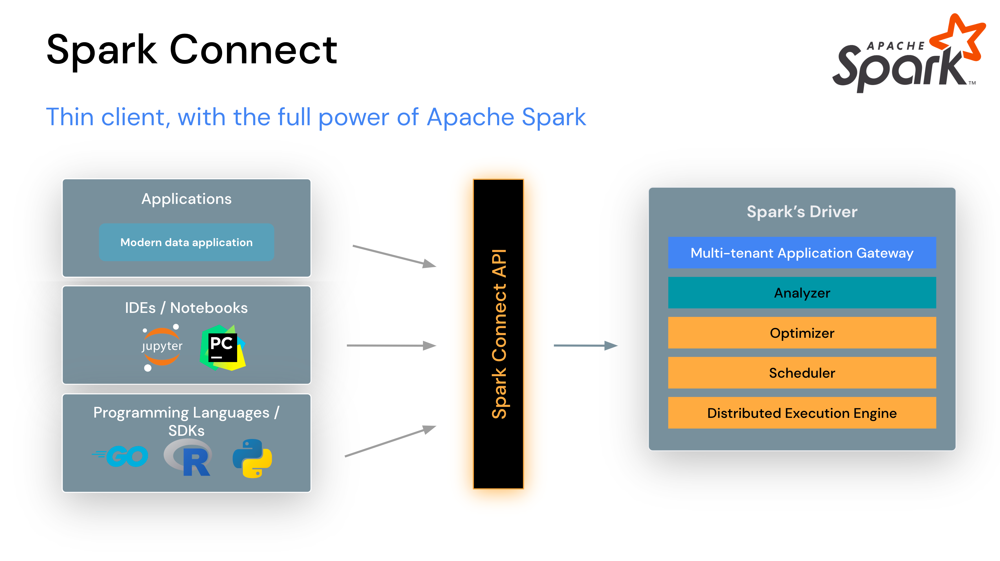

# Spark Connect Quickstart (IOMETE)

This repository provides example PySpark scripts and a notebook demonstrating how to connect to a Spark Connect cluster hosted on IOMETE.


## Spark Connect Overview

**Building client-side Spark applications** 

In Apache Spark > 3.4, Spark Connect introduced a decoupled client-server architecture that allows remote connectivity to Spark clusters using the DataFrame API and unresolved logical plans as the protocol. The separation between client and server allows Spark and its open ecosystem to be leveraged from everywhere. It can be embedded in modern data applications, in IDEs, Notebooks and programming languages.



### How Spark Connect works
The Spark Connect client library is designed to simplify Spark application development. It is a thin API that can be embedded everywhere: in application servers, IDEs, notebooks, and programming languages. The Spark Connect API builds on Spark’s DataFrame API using unresolved logical plans as a language-agnostic protocol between the client and the Spark driver.

The Spark Connect client translates DataFrame operations into unresolved logical query plans which are encoded using protocol buffers. These are sent to the server using the gRPC framework.

### Operational benefits of Spark Connect
With this new architecture, Spark Connect mitigates several multi-tenant operational issues:

- **Stability:** Applications that use too much memory will now only impact their own environment as they can run in their own processes. Users can define their own dependencies on the client and don’t need to worry about potential conflicts with the Spark driver.

- **Upgradability:** The Spark driver can now seamlessly be upgraded independently of applications, for example to benefit from performance improvements and security fixes. This means applications can be forward-compatible, as long as the server-side RPC definitions are designed to be backwards compatible.

- **Debuggability and observability:** Spark Connect enables interactive debugging during development directly from your favorite IDE. Similarly, applications can be monitored using the application’s framework native metrics and logging libraries.


For detailed information, visit [Spark Connect Documentation](https://spark.apache.org/docs/latest/spark-connect-overview.html).


## Running Examples

### Installation of Python Libraries

Dependencies are listed in `requirements.txt`. Installation in a virtual environment is recommended:

```shell
virtualenv .env
source .env/bin/activate
pip install -r requirements.txt
```

Alternatively, for global installation:

```shell
pip3 install -r requirements.txt
```


### Running PySpark Code

Copy the connection to the remote Spark Connect Clusters from the IOMETE console and paste it in the spark builder.

Retrieve the Spark Connect cluster connection details from the IOMETE console and integrate them into the spark builder in the `example.py`.

Execute the script using:

```shell
python example.py
```


### Running the Example Notebook

The provided notebook can be run in Jupyter locally, or through interfaces like Visual Studio Code or PyCharm. Before execute the notebook, retrieve the Spark Connect cluster connection details from the IOMETE console and integrate them into the spark builder in the notebook.


### Ease of Writing Spark Code
Beauty of Spark remote connect, it's only the thin client running on the local machine. Heavy lifting and all configurations are already implemented on the server side